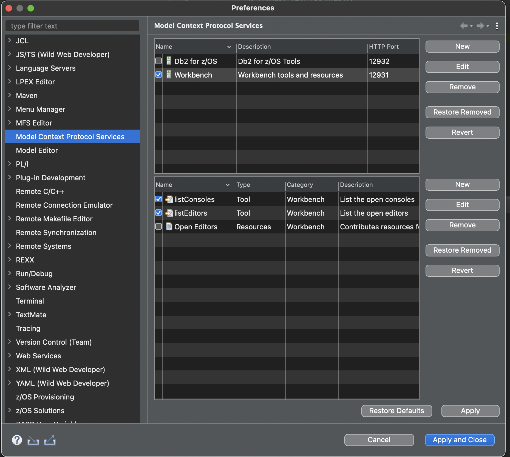
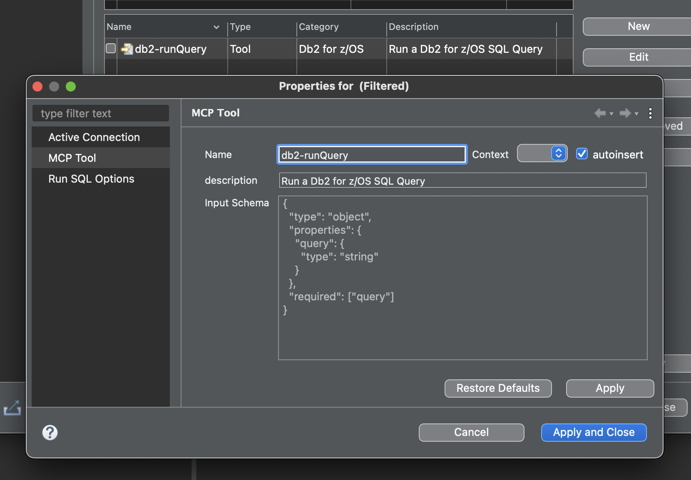
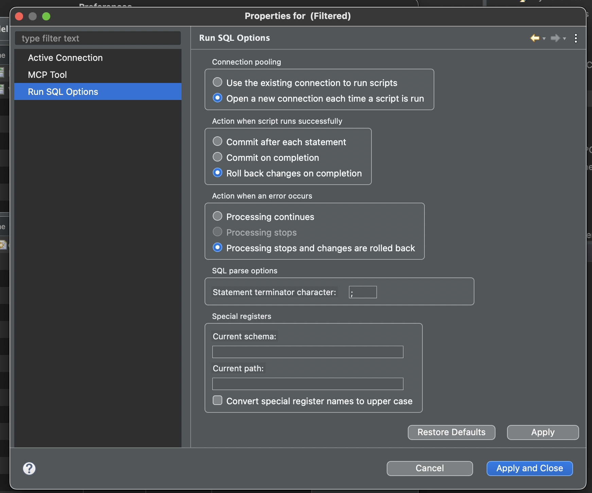

# Eclipse Plug-In Developer Extension for Model Context Protocol Services

The [org.eclipse.mcp.modelContextProtocolServer extension point](https://jwflicker.github.io/eclipse-mcp/org.eclipse.mcp/docs/modelContextProtocolServer.html) can be used to declare and instantiate Model Context Protocol (MCP) servers that run within the Eclipse IDE's VM enable interactivity between Eclipse based experiences and LLM Chat or Agents experience running within or outside of the Eclipse IDE.

It provides a simple mechanism to contribute MCP Tools and Resources to MCP servers running inside Eclipse.

It abstracts away the underlying dependencies such as [modelcontextprotocol/java-sdk(https://github.com/modelcontextprotocol/java-sdk)] and Jetty HTTP Server by providing an extension point and some simple Java Interaces, standing up and tearing down MCP and HTTP servers as user preferences are updated.

Provides a centralized location for users to organize and customize Eclipse MCP contributions from multiple vendors.

Provides a centralized registry of MCP servers running in the Eclipse process, enabling shell-shared experiences to invoke tools with a Java call rather than an HTTP call

## Documentation

- [Extension Point Documentation](https://jwflicker.github.io/eclipse-mcp/org.eclipse.mcp/docs/modelContextProtocolServer.html)
- [Java Docs](https://jwflicker.github.io/eclipse-mcp/org.eclipse.mcp/docs/javadoc/org/eclipse/mcp/package-summary.html)

## Demonstrations

- [Demo for Plug-in Developers]()
- [Demo for Eclipse and IDz Users]()
- [Early prototype of Eclipse and Chat interactivity]()

Update your Eclipse plugin to contribute your own MCP tool and resource controllers to the platform in a few steps

IT also adds a new "Platform MCP" preference page will let users:

- Customize Servers
  - Enable / Disable
  - Create / Delete servers and manage which Tools and Resource Controllers they serve
  - update HTTP port
  - Copy server url to clipboard
- Customize a Server's Tools and Resource Managers behavior
  - Add / Remove to server
  - Enable / Disable
  - 
  - Customize a Tool's name and description to suit an Agentic scenario
  - 
  - Customize Tools and Resource Controllers using unique property pages specific to the type of Tool/Resource
  - 

## [Extenion Point Documentation](https://jwflicker.github.io/eclipse-mcp/org.eclipse.mcp/docs/modelContextProtocolServer.html)

## [Java Docs](https://jwflicker.github.io/eclipse-mcp/org.eclipse.mcp/docs/javadoc/org/eclipse/mcp/package-summary.html)

To expose an aspect of your IDE plugin as an MCP tool, do the following:

## Getting Started:  Lets create an MCP Tool

1. Create or open an Eclipse Plugin Project
2. Add plugin `org.eclipse.mcp` as a dependency to your plugin
3. Create a class that implements [IMCPTool](https://jwflicker.github.io/eclipse-mcp/org.eclipse.mcp/docs/javadoc/org/eclipse/mcp/IMCPTool.html)

```java
/**
 * An MCP tool is an exported function that and LLM-powered Agent can invoke
 * 
 * MCP Tools are declared in extension point <code>org.eclipse.mcp.modelContextProtocolServer</code>
 * 
 * The <code>class<code> attribute of a <code>tool</code> must be an instance of <code>org.eclipse.mcp.IMCPTool</code>
 */
public interface IMCPTool {
  
  /**
   * Executes the MCP Tool
   * @param args A map of input parameters sent to this function matching the tool's declared input JSON schema
   * @param properties utility to fetch and prompt for user customized preference values
   * @return An array of strings representing the result of the tool execution.
   */
  public String[] apply(Map<String, Object> args, IElementProperties properties);

}
```

4. Define a JSON schema that describes the arguments your tool will accept, for example

```json
{
  "type": "object",
  "properties": {
    "connection-uuid": {
      "type": "string"
    },
    "query": {
      "type": "string"
    }
  },
  "required": ["connection-uuid", "query"]
}
```

5. Implement the logic for your tool, returning an array of Strings as your result

## Declare your tool as an extension in your plugin.xml

1. Using the Plugin Manifest Editor, add to your plugin.xml
    1. Add the 'org.eclipse.mcp.modelContextProtocolServer' extension
    2. Add to the extension an MCP Server with a name, id, description and default http port
    3. Add the the extension 1 or more tools, each with a name, id, description and JSON Schema input, and implementaton class.
        1. Agents will use the descirption and input schema to determine how and when to call your tool
        2. The JSON schema must be XML Escaped.
            1. Enter the value in the Plugin Editor, it will automatically escape the JSON schema for you.
    4. Add a binding between your tools and a server

Example:

```xml
 <extension
         point="org.eclipse.mcp.modelContextProtocolServer">
      <server
            description="Set of default tools for enabling Agent-driven development"
            id="org.eclipse.mcp.builtins"
            name="Built-in Eclipse MCP Server"
            version="0.0.1"
            defaultPort="12931">
      </server>
      <tool
            class="org.eclipse.mcp.builtin.tool.ListConsoles"
            id="org.eclipse.mcp.builtin.tool.ListConsoles"
            name="listConsoles"
            description="List the open Eclipse consoles"
            schema="{
				&quot;type&quot;: &quot;object&quot;,
				&quot;properties&quot;: {
				},
				&quot;required&quot;: []
			}">
      </tool>
      <toolServerBinding
            serverId="org.eclipse.mcp.builtins"
            toolId="org.eclipse.mcp.builtin.tool.ListConsoles">
      </toolServerBinding>
   </extension>
```

Thats all that is required.  Upon startup, MCP servers will start up and serve content over HTTP for the registered tools.  Calls to tools will be delegated to your instances of IMCPTool

### Future Considerations

1. Mechanism for shell-shared MCP Clients to invoke MCP tools as Java calls rather than HTTP calls, removing the need for HTTP endpoints when consumed internally and hand registration of MCP endpoints into co-installed MCP clients.
2. Preferences to  
    1. Enable/Disable MCP Servers and Tools
    2. Override the default HTTP port
    3. Option to enable/disable exposing server over HTTP
    4. Button to copy Server URL to clip-board
    5. Button for opening Tool-specific property editors
        1. For example, set the default Db2 Connection to use when running a SQL query.
    6. ?Option to customize a Tools name/prompt
3. Support for Resource Management extension point
    1. Templating support
4. Set of Built-in Tools, such as
    1. Access to Problems
    2. Access to Consoles
    3. Access to Editors

### References

- [Model Context Protocol](https://www.anthropic.com/news/model-context-protocol)
- [java sdk](https://github.com/modelcontextprotocol/java-sdk)
- [spring sdk](https://docs.spring.io/spring-ai-mcp/reference/mcp.html)
- [java sdk jar](https://mvnrepository.com/artifact/io.modelcontextprotocol.sdk/mcp/0.8.1)
- [quarkus examples](https://github.com/quarkiverse/quarkus-mcp-servers/tree/main/jdbc)
- [spring mcp](https://github.com/spring-projects-experimental/spring-ai-mcp)
- [MCP Client and Server with the Java MCP SDK and LangChain4j](https://glaforge.dev/posts/2025/04/04/mcp-client-and-server-with-java-mcp-sdk-and-langchain4j)

### Examples of Agentic IDE Tooling

- [Claude Code API Applied to other IDEs](https://github.com/anthropics/claude-code/issues/1234)
- [Windsurf Flow Awareness](https://windsurf.com/blog/windsurf-wave-9-swe-1)
- [The Hidden Algorithms Powering Your Coding Assistant](https://diamantai.substack.com/p/the-hidden-algorithms-powering-your?utm_campaign=post)